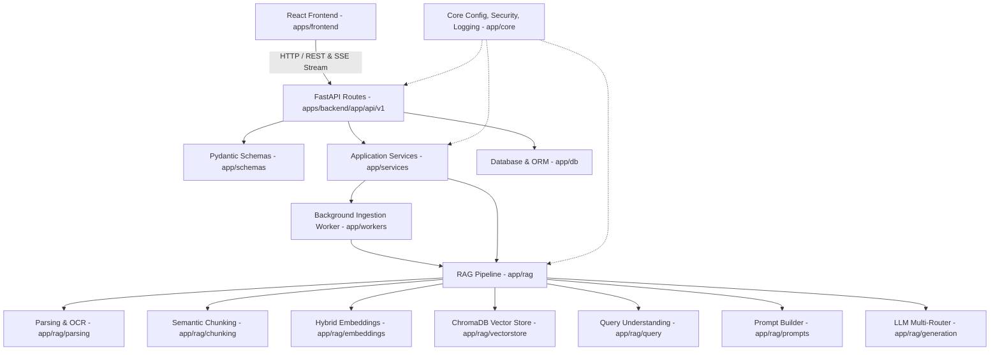

# DocMind AI — Architecture Audit & Migration Specification
**Date:** September 2026  
**Auditor:** Senior Full-Stack Software Architect & Staff-Level Systems Engineer  
**Repository:** DocMind AI  
**Audit Status:** Complete  

---

## 1. Executive Summary

DocMind AI is a production-grade Document Intelligence and Conversational Question-Answering application utilizing Retrieval-Augmented Generation (RAG). The platform features:
- **Backend:** FastAPI, SQLAlchemy (SQLite), ChromaDB vector database, dense embeddings (OpenAI, Gemini, local ONNX), LangChain chunking, multi-LLM routing (Anthropic Claude, OpenAI GPT, Google Gemini), and SSE streaming.
- **Frontend:** React 19, Vite 8, Tailwind CSS, Framer Motion, React Icons, Axios HTTP client with JWT interceptors.

The codebase implements advanced capabilities (sub-second query caching, multi-turn conversational memory, page-level citation generation, hierarchical chunking with OCR fallbacks). However, the physical filesystem architecture exhibits several structural issues common in rapidly evolving MVPs:
1. **Asymmetric Monorepo:** Frontend configuration and source files sit directly at repository root while backend resides in a subdirectory `backend/`.
2. **RAG Logic Scattering:** Retrieval, chunking, embeddings, prompt assembly, and query understanding are spread across `backend/app/services/`, `backend/app/api/prompts/`, and `backend/app/models/`.
3. **Layer Bleed:** Pydantic schemas and background worker tasks (`ingest_document_task`) are declared directly inside HTTP route modules (`backend/app/api/routes/`).
4. **Git Hygiene & Generated Artifacts:** Git index contains tracked `__pycache__` `.pyc` binaries, runtime SQLite files (`docmind.db`), persistent ChromaDB vector index files, test uploads, and `dist/` build output.
5. **Dangling / Dead Directories:** Empty directories (`src/assests` with typo, `src/styles`, `backend/app/config`, `backend/app/api/utils`, empty component folders) exist in the working directory.

---

## 2. Current Folder & File Structure

```
docmind-ai/
├── README.md
├── package.json
├── package-lock.json
├── vite.config.js
├── index.html
├── .oxlintrc.json
├── .gitignore
├── dist/                          # Generated production build
│   ├── assets/
│   ├── favicon.svg
│   ├── icons.svg
│   └── index.html
├── public/                        # Static assets
│   ├── favicon.svg
│   └── icons.svg
├── backend/                       # Python FastAPI Backend
│   ├── README.md
│   ├── requirements.txt
│   ├── .env.example
│   ├── venv/                      # Local Python environment
│   ├── logs/
│   │   └── app.log
│   ├── docs/
│   │   └── engineering-journal.md
│   ├── data/
│   │   ├── docmind.db             # Runtime SQLite database (tracked in git!)
│   │   ├── chromadb/              # Runtime ChromaDB vector store (tracked in git!)
│   │   └── uploads/               # Uploaded test documents (tracked in git!)
│   ├── tests/
│   │   ├── test_live_server.py
│   │   ├── test_rag_quality.py
│   │   ├── verify_all_qa_pass.py
│   │   └── verify_flow.py
│   └── app/
│       ├── main.py
│       ├── core/
│       │   ├── config.py
│       │   └── security.py
│       ├── db/
│       │   ├── database.py
│       │   └── models.py
│       ├── api/
│       │   ├── prompts/           # RAG prompt templates placed inside API layer!
│       │   │   ├── __init__.py
│       │   │   ├── ocr.py
│       │   │   ├── qa.py
│       │   │   ├── summary.py
│       │   │   └── system.py
│       │   ├── routes/
│       │   │   ├── auth.py
│       │   │   ├── chat.py
│       │   │   ├── documents.py
│       │   │   └── health.py
│       │   └── utils/             # Empty directory
│       ├── config/                # Empty directory
│       ├── models/
│       │   └── query_analysis.py  # Query dataclass placed in models/
│       ├── services/              # RAG monolith directory
│       │   ├── chunker.py
│       │   ├── embedding.py
│       │   ├── llm_router.py
│       │   ├── prompt_builder.py
│       │   ├── query_understanding.py
│       │   ├── rag_engine.py
│       │   └── vector_store.py
│       └── utils/
│           └── logger.py
└── src/                           # React 19 Frontend
    ├── App.jsx
    ├── main.jsx
    ├── index.css
    ├── assests/                   # Empty directory with spelling error
    │   ├── icons/
    │   ├── images/
    │   └── logos/
    ├── styles/                    # Empty directory
    ├── routes/
    │   └── AppRoutes.jsx
    ├── context/
    │   ├── AuthContext.jsx
    │   └── useAuth.js
    ├── services/
    │   ├── api.js
    │   ├── authService.js
    │   ├── chatService.js
    │   └── documentService.js
    ├── components/
    │   ├── auth/
    │   │   ├── GoogleAccountModal.jsx
    │   │   └── SocialLoginButtons.jsx
    │   ├── common/
    │   │   ├── ChatPreview/
    │   │   ├── ErrorBoundary.jsx
    │   │   ├── Features/
    │   │   ├── Footer/
    │   │   ├── Hero/
    │   │   ├── Navbar/
    │   │   └── ProtectedRoute.jsx
    │   └── (empty folders: chat, layout, pipeline, processing, profile, settings, upload)
    └── pages/
        ├── Landing/Landing.jsx
        ├── Login/Login.jsx
        ├── Register/Register.jsx
        ├── ForgotPassword/ForgotPassword.jsx
        ├── NotFound/NotFound.jsx
        ├── Upload/Upload.jsx
        └── Chat/
            ├── Chat.jsx
            ├── ChatSidebar.jsx
            ├── Composer.jsx
            └── MessageList.jsx
```

---

## 3. Module & File Responsibilities

### Backend Modules

| File | Current Layer | Real Responsibility | Target Layer |
|---|---|---|---|
| `backend/app/main.py` | App Root | FastAPI application bootstrap, CORS, router mounting, lifecycle | `apps/backend/app/main.py` |
| `backend/app/core/config.py` | Core | Pydantic Settings reading environment variables | `apps/backend/app/core/config.py` |
| `backend/app/core/security.py` | Core | Password hashing (`bcrypt`), JWT token generation/validation | `apps/backend/app/core/security.py` |
| `backend/app/utils/logger.py` | Utils | Centralized rotating file & stream logger | `apps/backend/app/core/logging.py` |
| `backend/app/db/database.py` | DB | SQLAlchemy engine, session maker, SQLite migration helper | `apps/backend/app/db/database.py` |
| `backend/app/db/models.py` | DB | SQLAlchemy ORM models (`User`, `Document`, `ConversationThread`, `ChatMessage`) | `apps/backend/app/db/models.py` |
| `backend/app/api/routes/auth.py` | API | HTTP route handlers for registration, login, profile, forgot password | `apps/backend/app/api/v1/auth.py` |
| `backend/app/api/routes/documents.py` | API | Upload, document status polling, auto-summary, deletion | `apps/backend/app/api/v1/documents.py` |
| `backend/app/api/routes/chat.py` | API | Thread management, SSE chat streaming (`/stream`), sync chat (`/query`) | `apps/backend/app/api/v1/chat.py` |
| `backend/app/api/routes/health.py` | API | Health check and system configuration summary | `apps/backend/app/api/v1/health.py` |
| `backend/app/services/chunker.py` | Services | Text extraction (PDF, DOCX, TXT, OCR) & LangChain recursive character chunking | `apps/backend/app/rag/chunking/` & `parsing/` |
| `backend/app/services/embedding.py` | Services | Dense embeddings via OpenAI, Gemini, or local ONNX fallback | `apps/backend/app/rag/embeddings/service.py` |
| `backend/app/services/vector_store.py` | Services | ChromaDB collection management, similarity search, vector persistence | `apps/backend/app/rag/vectorstore/chroma.py` |
| `backend/app/services/query_understanding.py` | Services | Query normalization and intent keyword classification | `apps/backend/app/rag/query/understanding.py` |
| `backend/app/models/query_analysis.py` | Models | Dataclass representing structured query analysis | `apps/backend/app/rag/query/analysis.py` |
| `backend/app/api/prompts/*` | API | Prompt templates for system instructions, QA, summary, OCR | `apps/backend/app/rag/prompts/` |
| `backend/app/services/prompt_builder.py` | Services | Prompt assembly engine combining context, history, and queries | `apps/backend/app/rag/prompts/builder.py` |
| `backend/app/services/llm_router.py` | Services | Multi-LLM provider abstraction (Anthropic, OpenAI, Gemini) and SSE stream generator | `apps/backend/app/rag/generation/router.py` |
| `backend/app/services/rag_engine.py` | Services | RAG orchestration (auto-summary, context compression, deduplication, Q&A pipeline) | `apps/backend/app/rag/pipeline/engine.py` |

### Frontend Modules

| File | Current Layer | Real Responsibility | Target Layer |
|---|---|---|---|
| `index.html`, `vite.config.js`, `package.json` | Root | Frontend build and bundling configuration | `apps/frontend/` |
| `src/main.jsx` | Root Source | React DOM mount, BrowserRouter, Toaster | `apps/frontend/src/main.jsx` |
| `src/App.jsx` | Root Source | Root application component with AuthProvider | `apps/frontend/src/app/App.jsx` |
| `src/routes/AppRoutes.jsx` | Routes | Application route tree & route guarding | `apps/frontend/src/routes/AppRoutes.jsx` |
| `src/context/AuthContext.jsx` & `useAuth.js` | Context | Global authentication state and session persistence | `apps/frontend/src/features/auth/context/` |
| `src/services/api.js` | Services | Centralized Axios HTTP client with bearer token interceptor | `apps/frontend/src/services/api.js` |
| `src/services/authService.js` | Services | Auth API endpoints (login, register, me, forgot-password, google) | `apps/frontend/src/features/auth/services/` |
| `src/services/documentService.js` | Services | Document upload, status polling, auto-summary, deletion endpoints | `apps/frontend/src/features/documents/services/` |
| `src/services/chatService.js` | Services | Thread operations, SSE chat streaming fetch, model catalogue | `apps/frontend/src/features/chat/services/` |
| `src/pages/Chat/*` | Pages | Chat layout (`Chat.jsx`), sidebar (`ChatSidebar.jsx`), input composer (`Composer.jsx`), message list (`MessageList.jsx`) | `apps/frontend/src/features/chat/` & `pages/Chat/` |
| `src/pages/Upload/*` | Pages | Drag-and-drop document upload interface | `apps/frontend/src/pages/Upload/` |
| `src/pages/Landing/*` | Pages | Marketing landing page with hero, features, preview, navbar, footer | `apps/frontend/src/pages/Landing/` |
| `src/pages/Login/*`, `Register/*`, `ForgotPassword/*` | Pages | Authentication views | `apps/frontend/src/pages/` |
| `src/components/common/*` | Components | Shared UI blocks: Navbar, Footer, Hero, Features, ChatPreview, ProtectedRoute, ErrorBoundary | `apps/frontend/src/components/common/` |
| `src/components/auth/*` | Components | Modal and social login buttons | `apps/frontend/src/features/auth/components/` |

---

## 4. Dependency Relationships



---

## 5. Detailed RAG Pipeline Flow

The DocMind AI RAG system operates across two discrete lifecycles: **Document Ingestion** and **Conversational Query Execution**.

### A. Document Ingestion Lifecycle
```
Document Upload (PDF/DOCX/TXT/Image)
  │
  ▼
API Controller (/documents/upload)
  │
  ▼ (spawns async BackgroundTask)
Ingestion Worker (app/workers/ingestion.py)
  │
  ├── 1. Parsing & OCR: Text extraction with page boundaries (--- [Page N] ---)
  │      via PyPDF, python-docx, Pillow, pytesseract (app/rag/parsing/)
  │
  ├── 2. Chunking: Recursive character splitting with hierarchical separators (app/rag/chunking/)
  │
  ├── 3. Embedding: Generation of dense vectors via OpenAI text-embedding-3-large,
  │      Gemini text-embedding-004, or local ONNX all-MiniLM-L6-v2 (app/rag/embeddings/)
  │
  ├── 4. Vector Storage: Insertion into persistent ChromaDB collection with cosine distance (app/rag/vectorstore/)
  │
  └── 5. Auto-Summarization: Representative chunk sampling + LLM executive summary generation (app/rag/pipeline/)
         └── Status updated to 'ready' in SQLite database
```

### B. Query & Retrieval Lifecycle
```
User Query + Thread ID + Document Context
  │
  ▼
API Controller (/chat/stream or /chat/query)
  │
  ├── 1. Query Understanding & Normalization: Detect intent (SUMMARY, DEFINITION, LOCATION, etc.)
  │      and expand short queries for optimal recall (app/rag/query/)
  │
  ├── 2. Vector Retrieval: Sub-second similarity search against ChromaDB collection (app/rag/vectorstore/)
  │
  ├── 3. Filtering & Deduplication: Near-duplicate suppression to optimize context diversity (app/rag/pipeline/)
  │
  ├── 4. Context Assembly & Token Bounding: Sentence-boundary preserved token budget compression (app/rag/pipeline/)
  │
  ├── 5. Prompt Synthesis: Context + multi-turn history + citations assembled cleanly (app/rag/prompts/)
  │
  ├── 6. Multi-LLM Routing & Generation: Claude, GPT, or Gemini dispatch with fallback logic (app/rag/generation/)
  │
  └── 7. Streaming Response: SSE event delivery (`data: {"type": "token", "content": "..."}`) to client
```

---

## 6. Frontend Architecture Analysis
- **Framework:** React 19 with Vite 8.
- **State Management:** React Context API (`AuthContext`), local hook state in chat/document components.
- **Communication:** Axios instance with request/response interceptors for JWT bearer tokens and automatic 401 eviction; native `fetch()` + `ReadableStream` for Server-Sent Events chat token streaming.
- **Strengths:** Clean dark-mode UI inspired by Linear and ChatGPT, glassmorphic styling, responsive layout, dedicated chat sidebar and composer components.
- **Weaknesses:**
  - Placed at repository root rather than in an isolated workspace under `apps/frontend/`.
  - Empty directories from legacy scaffolding (`assests`, `styles`, `components/pipeline`, etc.).
  - Missing co-location of feature components with their respective services.

---

## 7. Backend Architecture Analysis
- **Framework:** FastAPI with Uvicorn async server.
- **Database:** SQLite with SQLAlchemy ORM, automatic schema migration for columns like `thread_id`, `status`, `summary`.
- **RAG Architecture:** Strong hybrid embedding capability (falls back to local ONNX when API keys are absent), resilient prompt templates, multi-model support.
- **Weaknesses:**
  - Everything lumped inside `app/services/` without separation of chunking, embedding, vector store, prompts, query understanding, and generation.
  - Background worker task defined directly in the API route file.
  - Pydantic schemas placed inside route files instead of dedicated schema modules.
  - Configuration directory `backend/app/config/` was empty while `backend/app/core/config.py` was used.

---

## 8. Database Architecture Analysis
- **Engine:** SQLite (`sqlite:///./data/docmind.db`).
- **ORM:** SQLAlchemy declarative models:
  - `User`: Accounts, credentials (`hashed_password` via bcrypt), profile.
  - `Document`: Metadata, file paths, chunk counts, vector collection names, processing status, auto-summaries.
  - `ConversationThread`: Multi-turn chat conversation sessions with timestamps.
  - `ChatMessage`: Individual user query / assistant answer turns with thread and document foreign keys.
- **Separation:** Relational metadata is stored in SQLite; vector embeddings are isolated in ChromaDB.

---

## 9. Authentication & Security Architecture
- Password hashing powered by `passlib` with `bcrypt`.
- JWT access tokens signed with `HS256` and configurable expiration (default 24h).
- OAuth2 Bearer token extraction via FastAPI dependency `get_current_user`.
- Multi-tenant data isolation: all document queries, thread lookups, and message retrievals enforce `user_id == current_user.id`.

---

## 10. Testing Architecture
- Existing test suite located in `backend/tests/`:
  - `verify_flow.py`: End-to-end user registration, authentication, document upload, chunking, embedding, ChromaDB indexing, and SSE chat streaming test using FastAPI `TestClient`.
  - `test_rag_quality.py`: Tests semantic ONNX embeddings, prompt templates, LLM router resolution, Anthropic Claude mocking, token context compression, and multi-turn conversational memory.
  - `test_live_server.py`: Live HTTP test suite against running server.
  - `verify_all_qa_pass.py`: Multi-tenant isolation verification and regression suite.
- Current tests execute successfully with zero failures.

---

## 11. Git Hygiene, Generated Files & Tracked Artifacts

| Item | Problem | Corrective Action |
|---|---|---|
| `backend/app/**/__pycache__/*.pyc` | Bytecode tracked in git index | Remove from git tracking, add to `.gitignore` |
| `backend/data/docmind.db` | Local runtime database tracked in git | Remove from git tracking, add `*.db`, `*.sqlite3` to `.gitignore` |
| `backend/data/chromadb/*` | ChromaDB vector storage binary files tracked | Remove from git tracking, add `data/chromadb/` to `.gitignore` |
| `backend/data/uploads/user_1/*` | Personal uploaded test documents tracked | Remove from git tracking, add `data/uploads/` to `.gitignore` |
| `dist/` | Pre-built frontend bundle tracked at root | Remove from git tracking, keep ignored |
| `backend/logs/app.log` | Runtime log file | Keep ignored, ensure directory exists |
| `.gitignore` | Missing Python, DB, Vector, and OS patterns | Update `.gitignore` with production-grade rules |

---

## 12. Dead, Unused, and Duplicate Files

1. **Typo Folder:** `src/assests/` (empty with subdirectories `icons/`, `images/`, `logos/`) — Delete.
2. **Empty Folders:**
   - `src/styles/` — Delete.
   - `src/components/chat/` — Delete (active chat components are in `src/pages/Chat/`).
   - `src/components/layout/` — Delete.
   - `src/components/pipeline/` — Delete.
   - `src/components/processing/` — Delete.
   - `src/components/profile/` — Delete.
   - `src/components/settings/` — Delete.
   - `src/components/upload/` — Delete (active upload page is in `src/pages/Upload/`).
   - `backend/app/config/` — Delete (settings reside in `backend/app/core/config.py`).
   - `backend/app/api/utils/` — Delete.

---

## 13. Proposed Target Architecture

```
docmind-ai/
├── apps/
│   ├── frontend/                       # React 19 + Vite 8 Single Page App
│   │   ├── public/
│   │   │   ├── favicon.svg
│   │   │   └── icons.svg
│   │   ├── src/
│   │   │   ├── app/
│   │   │   │   └── App.jsx
│   │   │   ├── assets/
│   │   │   ├── components/
│   │   │   │   ├── common/             # Shared presentation components
│   │   │   │   │   ├── Navbar/
│   │   │   │   │   ├── Footer/
│   │   │   │   │   ├── Hero/
│   │   │   │   │   ├── Features/
│   │   │   │   │   ├── ChatPreview/
│   │   │   │   │   ├── ErrorBoundary.jsx
│   │   │   │   │   └── ProtectedRoute.jsx
│   │   │   │   └── ui/
│   │   │   ├── features/
│   │   │   │   ├── auth/
│   │   │   │   │   ├── components/     # GoogleAccountModal, SocialLoginButtons
│   │   │   │   │   ├── context/        # AuthContext, useAuth
│   │   │   │   │   └── services/       # authService
│   │   │   │   ├── chat/
│   │   │   │   │   ├── components/     # ChatSidebar, Composer, MessageList
│   │   │   │   │   └── services/       # chatService
│   │   │   │   └── documents/
│   │   │   │       └── services/       # documentService
│   │   │   ├── pages/
│   │   │   │   ├── Landing/
│   │   │   │   ├── Login/
│   │   │   │   ├── Register/
│   │   │   │   ├── ForgotPassword/
│   │   │   │   ├── Chat/
│   │   │   │   ├── Upload/
│   │   │   │   └── NotFound/
│   │   │   ├── routes/
│   │   │   │   └── AppRoutes.jsx
│   │   │   ├── services/
│   │   │   │   └── api.js              # Central Axios client
│   │   │   ├── index.css
│   │   │   └── main.jsx
│   │   ├── package.json
│   │   ├── vite.config.js
│   │   ├── index.html
│   │   ├── .oxlintrc.json
│   │   └── README.md
│   │
│   └── backend/                        # FastAPI Python Backend
│       ├── app/
│       │   ├── api/
│       │   │   └── v1/
│       │   │       ├── router.py       # Aggregator router
│       │   │       ├── auth.py         # Auth endpoints
│       │   │       ├── documents.py    # Document endpoints
│       │   │       ├── chat.py         # Chat & SSE stream endpoints
│       │   │       └── health.py       # Healthcheck endpoint
│       │   ├── core/
│       │   │   ├── config.py           # Pydantic Settings
│       │   │   ├── security.py         # Passwords & JWT
│       │   │   └── logging.py          # Rotating logger
│       │   ├── db/
│       │   │   ├── database.py         # Engine & session
│       │   │   └── models.py           # SQLAlchemy models
│       │   ├── schemas/                # Pydantic validation schemas
│       │   │   ├── auth.py
│       │   │   ├── documents.py
│       │   │   └── chat.py
│       │   ├── services/               # Application business logic
│       │   │   ├── auth_service.py
│       │   │   ├── document_service.py
│       │   │   └── chat_service.py
│       │   ├── workers/                # Background async workers
│       │   │   └── ingestion_worker.py
│       │   ├── rag/                    # Decomposed RAG Pipeline
│       │   │   ├── parsing/            # Text extraction & OCR (PDF, DOCX, TXT, Images)
│       │   │   │   └── parser.py
│       │   │   ├── chunking/           # Semantic splitting
│       │   │   │   └── chunker.py
│       │   │   ├── embeddings/         # Dense embedding services
│       │   │   │   └── service.py
│       │   │   ├── vectorstore/        # ChromaDB manager
│       │   │   │   └── chroma.py
│       │   │   ├── query/              # Query normalization & intent detection
│       │   │   │   ├── analyzer.py
│       │   │   │   └── models.py
│       │   │   ├── prompts/            # Prompt templates & assembly builder
│       │   │   │   ├── builder.py
│       │   │   │   ├── system.py
│       │   │   │   ├── qa.py
│       │   │   │   ├── summary.py
│       │   │   │   └── ocr.py
│       │   │   ├── generation/         # Multi-LLM provider router
│       │   │   │   └── router.py
│       │   │   └── pipeline/           # RAG Orchestrator
│       │   │       └── engine.py
│       │   └── main.py                 # FastAPI application factory
│       ├── tests/                      # Unit & integration tests
│       │   ├── unit/
│       │   ├── rag/
│       │   │   └── test_rag_quality.py
│       │   └── api/
│       │       ├── test_live_server.py
│       │       ├── verify_all_qa_pass.py
│       │       └── verify_flow.py
│       ├── requirements.txt
│       ├── .env.example
│       └── README.md
│
├── data/                               # Shared data directory
│   ├── uploads/                        # User document uploads
│   ├── chromadb/                       # Vector index storage
│   ├── raw/
│   ├── processed/
│   └── evaluation/
│
├── docs/                               # Production documentation
│   ├── architecture/
│   │   ├── ARCHITECTURE.md
│   │   └── PROJECT_STRUCTURE.md
│   ├── rag/
│   │   └── RAG_PIPELINE.md
│   ├── api/
│   │   └── API_REFERENCE.md
│   ├── development/
│   │   └── GETTING_STARTED.md
│   └── engineering-journal.md
│
├── scripts/
│   ├── development/
│   │   ├── run_backend.sh
│   │   └── run_frontend.sh
│   ├── database/
│   └── ingestion/
│
├── infra/
│   ├── docker/
│   │   ├── Dockerfile.backend
│   │   ├── Dockerfile.frontend
│   │   └── nginx.conf
│   └── docker-compose.yml
│
├── .gitignore
├── README.md
└── ARCHITECTURE_AUDIT.md
```

---

## 14. File-by-File Migration Mapping

| Current Location | Target Location | Type of Operation |
|---|---|---|
| `package.json` | `apps/frontend/package.json` | Move |
| `package-lock.json` | `apps/frontend/package-lock.json` | Move |
| `vite.config.js` | `apps/frontend/vite.config.js` | Move |
| `index.html` | `apps/frontend/index.html` | Move |
| `.oxlintrc.json` | `apps/frontend/.oxlintrc.json` | Move |
| `public/*` | `apps/frontend/public/*` | Move |
| `src/App.jsx` | `apps/frontend/src/app/App.jsx` | Move & update imports |
| `src/main.jsx` | `apps/frontend/src/main.jsx` | Move & update imports |
| `src/index.css` | `apps/frontend/src/index.css` | Move |
| `src/routes/*` | `apps/frontend/src/routes/*` | Move & update imports |
| `src/context/*` | `apps/frontend/src/features/auth/context/*` | Move (alias re-export in `src/context/` for safety) |
| `src/services/*` | `apps/frontend/src/services/*` | Move & maintain backward-compatible re-exports |
| `src/components/common/*` | `apps/frontend/src/components/common/*` | Move |
| `src/components/auth/*` | `apps/frontend/src/features/auth/components/*` | Move (alias re-export in `src/components/auth/` for safety) |
| `src/pages/*` | `apps/frontend/src/pages/*` | Move |
| `backend/requirements.txt` | `apps/backend/requirements.txt` | Move |
| `backend/.env.example` | `apps/backend/.env.example` | Move |
| `backend/README.md` | `apps/backend/README.md` | Move |
| `backend/app/main.py` | `apps/backend/app/main.py` | Move & update router mounts |
| `backend/app/core/config.py` | `apps/backend/app/core/config.py` | Move & configure flexible path resolution |
| `backend/app/core/security.py` | `apps/backend/app/core/security.py` | Move |
| `backend/app/utils/logger.py` | `apps/backend/app/core/logging.py` | Move (alias re-export in `app/utils/logger.py` for safety) |
| `backend/app/db/database.py` | `apps/backend/app/db/database.py` | Move |
| `backend/app/db/models.py` | `apps/backend/app/db/models.py` | Move |
| `backend/app/api/routes/auth.py` | `apps/backend/app/api/v1/auth.py` | Move & extract schemas to `schemas/auth.py` |
| `backend/app/api/routes/documents.py` | `apps/backend/app/api/v1/documents.py` | Move & extract worker to `workers/ingestion_worker.py` |
| `backend/app/api/routes/chat.py` | `apps/backend/app/api/v1/chat.py` | Move & extract schemas to `schemas/chat.py` |
| `backend/app/api/routes/health.py` | `apps/backend/app/api/v1/health.py` | Move |
| `backend/app/services/chunker.py` | `apps/backend/app/rag/chunking/chunker.py` | Move & decompose parser |
| `backend/app/services/embedding.py` | `apps/backend/app/rag/embeddings/service.py` | Move |
| `backend/app/services/vector_store.py` | `apps/backend/app/rag/vectorstore/chroma.py` | Move |
| `backend/app/services/query_understanding.py` | `apps/backend/app/rag/query/analyzer.py` | Move |
| `backend/app/models/query_analysis.py` | `apps/backend/app/rag/query/models.py` | Move |
| `backend/app/api/prompts/*` | `apps/backend/app/rag/prompts/*` | Move |
| `backend/app/services/prompt_builder.py` | `apps/backend/app/rag/prompts/builder.py` | Move |
| `backend/app/services/llm_router.py` | `apps/backend/app/rag/generation/router.py` | Move |
| `backend/app/services/rag_engine.py` | `apps/backend/app/rag/pipeline/engine.py` | Move |
| `backend/tests/*` | `apps/backend/tests/*` | Move & preserve import paths |
| `backend/docs/engineering-journal.md` | `docs/engineering-journal.md` | Move |

---

## 15. Safe Execution Plan

1. **Safety Checkpoint:** Verify clean branch status and baseline test/build pass.
2. **Directory Scaffolding:** Create `apps/frontend/`, `apps/backend/app/rag/`, `apps/backend/app/schemas/`, `apps/backend/app/workers/`, `data/`, `docs/`, `scripts/`, `infra/`.
3. **Backend Migration & Re-exports:** Migrate modules to their clean architectural locations while providing backward-compatible re-exports in `app/services/`, `app/api/prompts/`, and `app/utils/` so any legacy or external references remain 100% functional.
4. **Worker & Schema Extraction:** Decouple schemas from routes and move `ingest_document_task` to `app/workers/ingestion_worker.py`.
5. **Frontend Migration:** Safely move frontend to `apps/frontend/`, preserving all component logic and updating path resolutions.
6. **Git Hygiene Cleanup:** Update `.gitignore` and untrack cached `.pyc`, SQLite databases, ChromaDB vectors, and uploaded test documents.
7. **Verification:**
   - Execute backend test suites: `verify_flow.py`, `test_rag_quality.py`.
   - Execute frontend build: `npm run build` in `apps/frontend`.
   - Validate API startup and import health.
8. **Final Documentation:** Produce `docs/architecture/PROJECT_STRUCTURE.md` and update root `README.md`.
